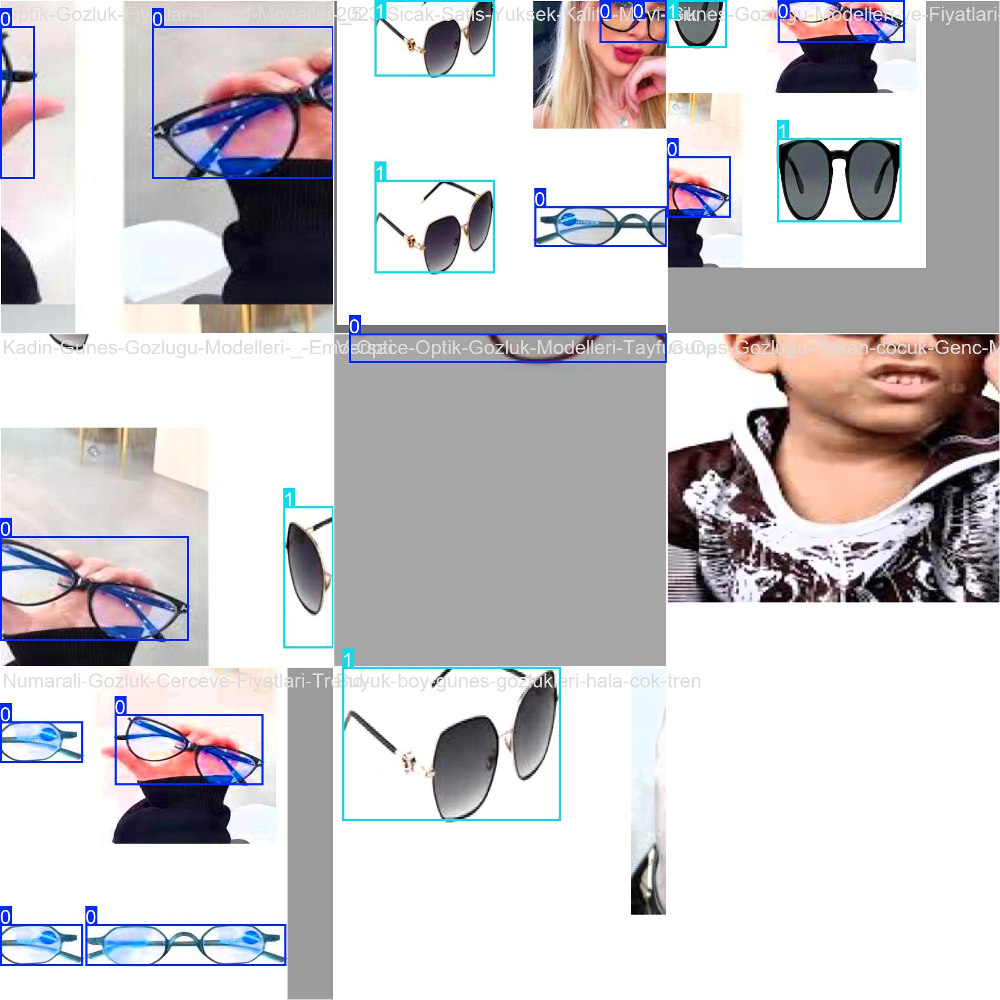
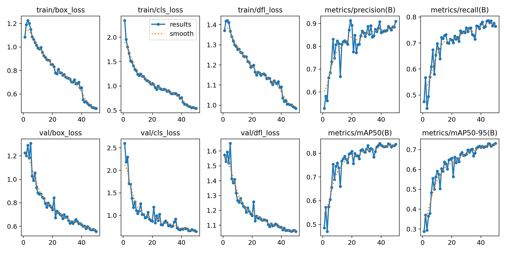
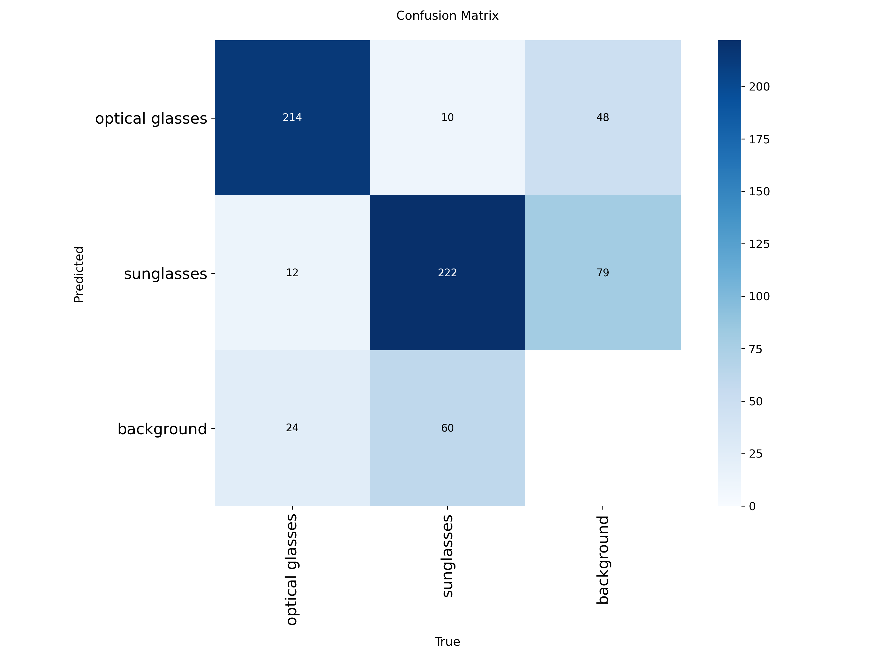

 Gözlük Tipi Tespit Sistemi (Eyewear Detection)

Bu proje, görüntü ve video karelerindeki **Güneş Gözlüğü** ve **Optik Gözlük** nesnelerini ayırt etmek için geliştirilmiş bir derin öğrenme modelidir. 

---

 Proje Özellikleri
 **Güneş Gözlüğü Tespiti:** Koyu camlı modellerin tanınması.
 **Optik Gözlük Tespiti:** Şeffaf camlı çerçevelerin ayırt edilmesi.
 **YOLOv8:** Yüksek doğruluk ve hızlı çıkarım.
 **Veri Seti:** Yaklaşık 1900 etiketli görüntü.

---

## 📊 Eğitim Sonuçları ve Veri Artırma

Modelin eğitimi sırasında kullanılan veri artırma (augmentation) örnekleri ve başarı grafikleri aşağıdadır:

### Veri Artırma Örnekleri


### Başarı Grafikleri (Results)


### Karmaşıklık Matrisi (Confusion Matrix)


---

##  Teknik Yığın
* **Dil:** Python 
* **Framework:** Ultralytics YOLOv8 
* **Platform:** Roboflow & Anaconda 

## Kurulum
```bash
pip install ultralytics opencv-python
